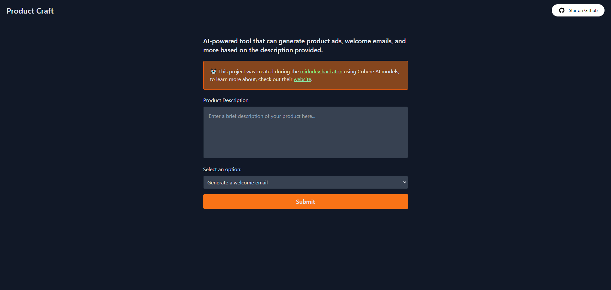

<div align="center">
  <a href="https://product-craft.vercel.app">
    
  </a>
</div>

## [📦] Built with:

- **SvelteKit**
- **TypeScript**
- **TailwindCSS**
- **Cohere.AI**

## [🔧] Development setup

1. Clone the repository:

```bash
git clone git@github.com:techwithmat/product-craft.git
```

2. Install dependencies:

```bash
pnpm install
```

3. Create a **.env** file with the following content:

```env
PUBLIC_COHERE_API_KEY=
```

Open [localhost:5173](http://localhost:5173/) with your browser to see the result.

## 🔑 License

- [MIT](https://github.com/techwithmat/product-craft/blob/main/LICENSE)
